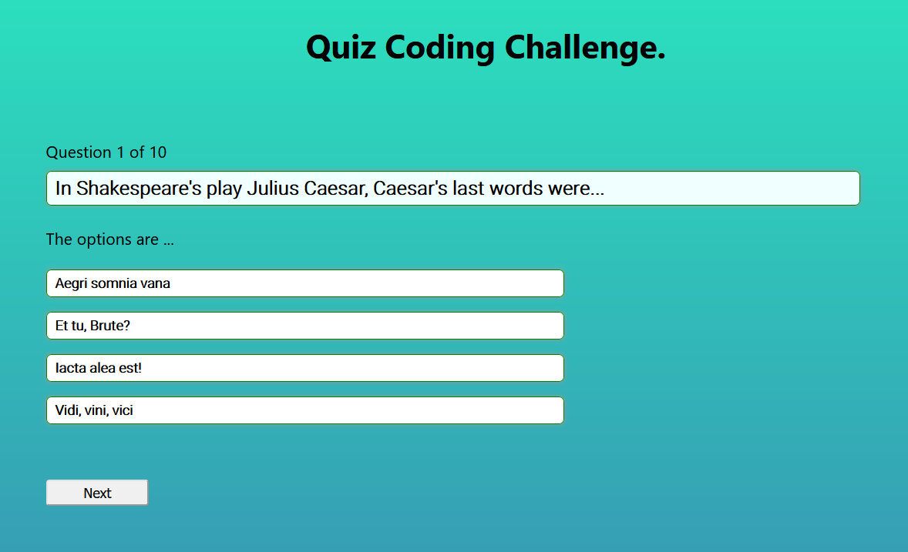

# Quiz Coding Challenge

# [Deployed App](https://quiz-code-challenge.web.app/)



---

## This repo represents `Tandem Code Challenge`.

- Used React to solve this challenge.

- As per requirement criteria<br>

  - Selecting 10 random questions from 21 provided.

  - Integrating correctAnswer with incorrect answer options provided.

  - User can see only one question with four options for answer at a time.

  - User can select only one option as a answer.

  - Showing correct answer with alert after submission of answer (later will move to UI).

  - On last question after FINISH button click, user can see final score, question and answers.

- You can see the challenge by going to this link https://quiz-code-challenge.web.app/

- To run it locally on your computer <br>
  - clone this repo to your computer `git clone https://github.com/lajawanti/quiz-coding-challenge.git`

  - cd into `quiz-coding-challenge`

  - As `/node_modules` not pushed to github you need to run `npm install` to install all dependencies needed.

  - See `/node_modules` folder created under `quiz-coding-challnge`

  - Run `npm start` <br><br>- You can see [http://localhost:3000](http://localhost:3000) in the browser.

## File structure

- Notice the file structure. There are certainly many ways by which one could layout an application.
- This pattern is commonly used:

```
src
|--  components
|      |---header
|      |     |---Header.js
|      |     |---Header.css
|      |     |---Header.test.js
|      |---questionAndAnswer
|      |     |---QuestionAndAnswer.js
|      |     |---QuestionAndAnswer.css
|      |     |---QuestionAndAnswer.test.js
|      |---questionDisplay
|      |     |---QuestionDisplay.js
|      |     |---QuestionDisplay.css
|      |     |---QuestionDisplay.test.js
|      |---quizResult
|      |     |---QuizResult.js
|      |     |---QuizResult.css
|      |     |---QuizResult.test.js
|-- App.js
|-- App.css
|-- index.js
|-- index.css
|-- gitignore
|-- package.json
|-- README.md
```

- You will notice every componet has three files one with`.js` includes actual code for view, `.css` includes styling and `'test.js` includes basic test for the same component.

-
